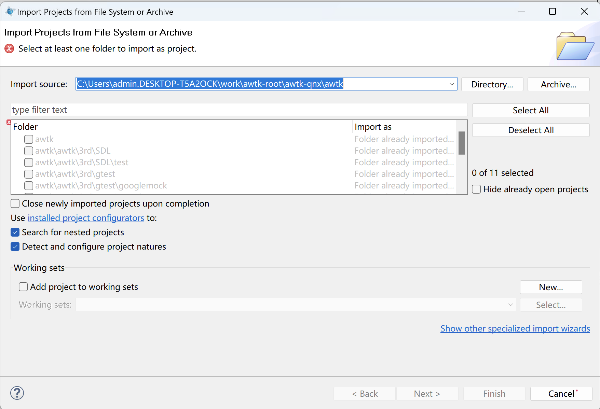
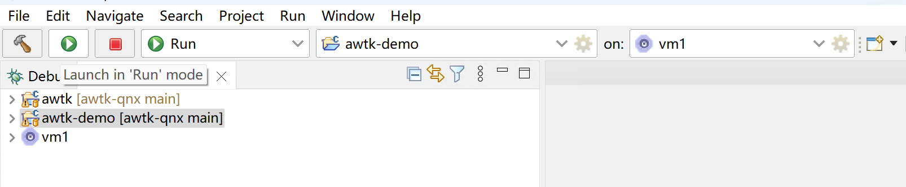

# awtk-qnx

> 据百度百科上说，“在汽车领域，QNX 早已是最大的操作系统供应商。据不完全资料显示，QNX 在车用市场占有率达到 75%，目前全球有超过 230 种车型使用 QNX 系统，包括哈曼贝克、德尔福、大陆、通用电装、爱信等知名汽车电子平台都是在 QNX 系统上搭建的。几乎全球所有的主要汽车品牌包括讴歌、阿尔法-罗密欧、奥迪、宝马、别克、凯迪拉克、雪弗兰、克莱斯勒、戴姆勒、道奇、菲亚特、福特、通用汽车、本田、悍马、现代、英菲尼迪、捷豹、吉普、蓝旗亚、马自达、马赛地、迷你宝马、三菱、尼桑、欧宝、庞迪克、保时捷、萨博、土星、双龙、丰田和大众汽车等目前都采用了基于 QNX 技术的系统。”

[AWTK](https://github.com/zlgopen/awtk) 全称 Toolkit AnyWhere，是 ZLG 开发的开源 GUI 引擎，旨在为嵌入式系统、WEB、各种小程序、手机和 PC 打造的通用 GUI 引擎，为用户提供一个功能强大、高效可靠、简单易用、可轻松做出炫酷效果的 GUI 引擎。

本项目是 [AWTK](https://github.com/zlgopen/awtk) 在 [QNX](https://https://blackberry.qnx.com/en) 平台的移植。

## 建立 QNX 图形开发环境

请参考 [在 Windows 下建立 QNX 图形开发环境](docs/notes1.md)

## 下载源码

* awtk-qnx

```shell
git clone https://github.com/zlgopen/awtk-qnx
``` 

* awtk

```shell
cd awtk-qnx/awtk
git clone https://github.com/zlgopen/awtk
```

* awtk-demo-app
  
```shell
cd awtk-qnx/awtk-demo
git clone https://github.com/zlgopen/awtk-demo-app
```

## 打开工程

> 从文件系统打开工程，分别打开 awtk 和 awtk-demo-app 工程。





## 编译

> 依次编译 awtk 和 awtk-demo-app 工程。


## 运行



## 效果

在 Vmware 中可以看到 AWTK 的 UI 界面。

