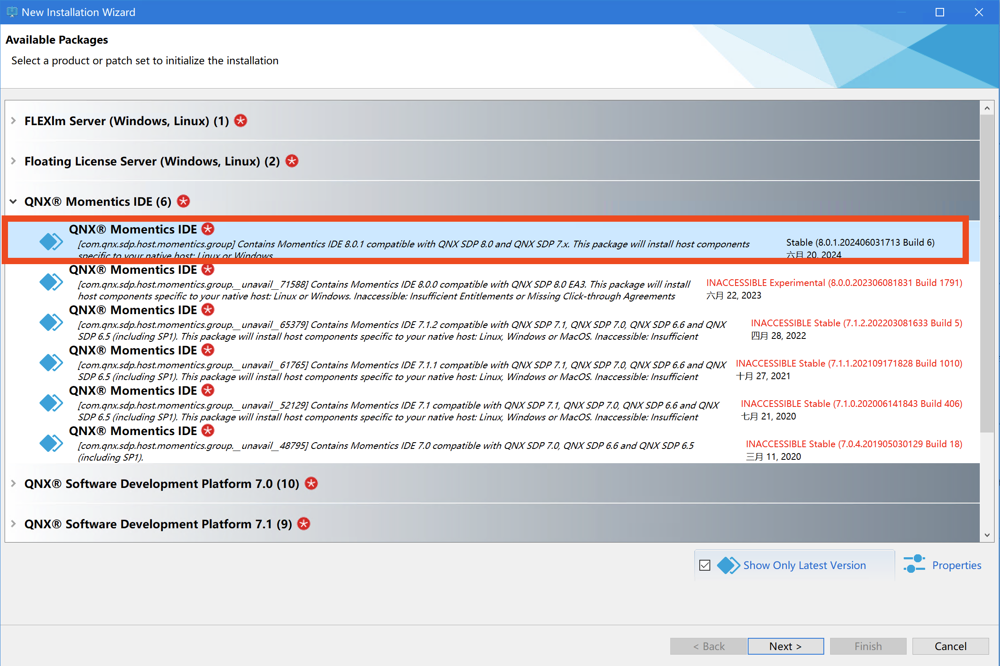
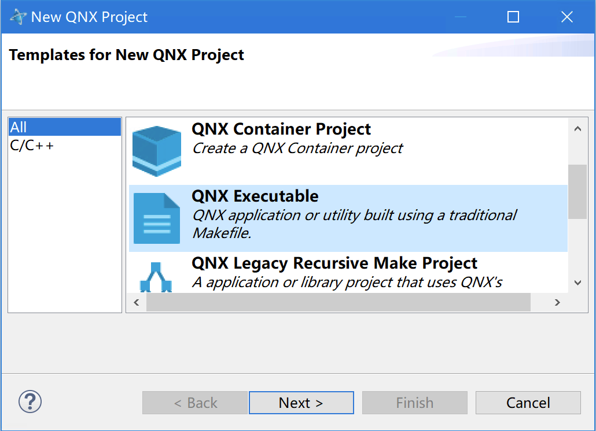

# 在 Windows 下建立 QNX 图形开发环境

关于建立 QNX 开发环境的文章有不少，但都是建立普通 C/C++ 开发环境的，而没有涉及到图形开发环境的。最近为了移植 AWTK 到 QNX, 花了不少功夫去研究，踩了不少坑，在这里记录一下，供有需要的朋友参考。

QNX 不支持在 MacOS 上开发，先在 Linux 上尝试了一下，使用 qemu 作为虚拟机，建立了一个 QNX 的开发环境，整个过程还是比较顺利的，但是无法启动图形系统。

QNX 可以在 qemu、VMware、VirtualBox 等虚拟机上运行，但是要启动图形系统，并不是每种虚拟机都能成功。经过多次尝试，发现只有 VMware 能够成功启动图形系统，所以建议使用 VMware 来运行 QNX。

## 1. 下载安装 VMware

可以到 [VMware 官网](https://www.vmware.com/cn.html) 下载 VMware Workstation Player，过程比较繁琐，可以用 360 软件管家安装，非商业版不需 key。

## 2. 下载 QNX 软件中心

* 注册账号，登录之后，创建一个非商业版的 license

* 下载 QNX 软件中心 Windows 版

* 安装 QNX 软件中心

> 默认安装，安装完成后，会启动软件中心，然后通过它安装 QNX SDP 8.0 和 QNX Momentics IDE

## 3. 安装 QNX SDP 8.0

## 4. 安装 QNX Momentics IDE

## 5. 启动 IDE QNX Momentics IDE

## 6. 创建一个 QNX 项目

> 选择创建 QNX Executable

## 7. 创建虚拟机

* 点击 toolbar 上的 on 旁边的下拉框，选择 New Launch Target

* 选择 QNX Virtual Machine Target

* 配置虚拟机

> - VM Platform 选择 VMware
> - CPU Architecture 选择 x86_64
> - Extra Options 指定 --grahics=yes

> --grahics=yes 参数也是个坑，开始不知道有这个参数，导致无法启动图形系统，后来在 mkqnximage 工具的帮助文档中找到了这个参数。但是在使用 qemu 时，总是提示依赖某些组件，无法启动图形系统，把 SDP 重装了几遍，最后差点就放弃了。

点击 finish，会自动创建一个虚拟机，然后启动虚拟机，会看到 QNX 的启动界面。

> 这界面也是个坑，启动非常非常慢，要耐心等待，不要以为卡死了。我开始以为卡死了，重启了几次，又去检查虚拟机的参数，重新构建了几次。最后一次，我干脆出去散步了，回来发现启动成功了。

## 8. 图形程序

在 qnx800\source\src-screen-examples-4.0.1.tgz 中，QNX 提供的一些图形例子，可以用来测试图形系统是否正常。

这里以 src\apps\screen\tutorials\win-vsync 为例，编译运行后可以看到：

> 如果只是把 win-vsync.c 的内容拷贝到 demo1.c 里，还需要修改一下 Makefile，链接 screen 库：

## 9. 总结

如果是第一次接触 QNX，整个过程可能会比较繁琐，有的错误提示也是莫名其妙。希望这篇文章对您有所帮助。